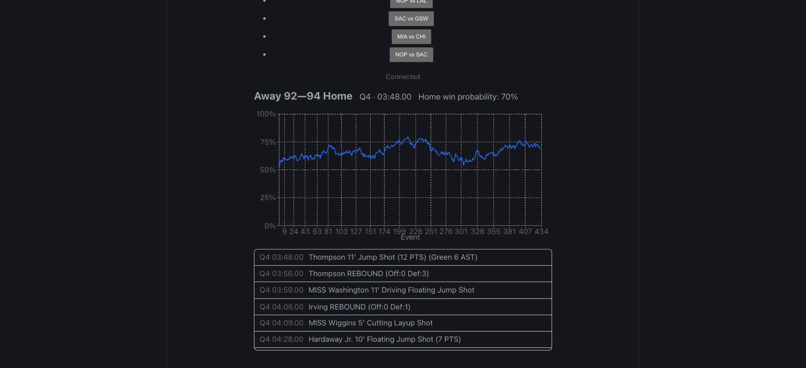
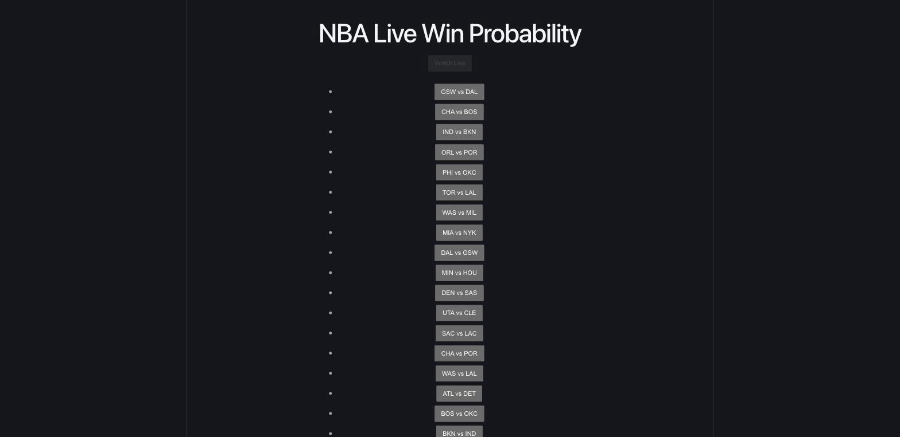
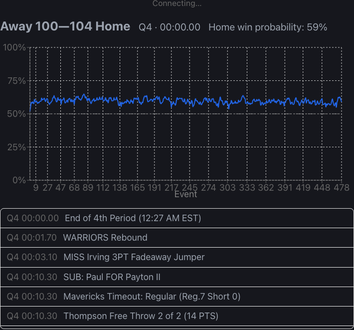

# NBA Win Probability

A live NBA win-probability model — a PyTorch LSTM watches play-by-play events one at a time and outputs P(home team wins) at every point in the game, served through a FastAPI backend and a React live-updating chart.

[](https://github.com/iggym21/NBAWinProb/actions/workflows/ci.yml)


*Win probability across a completed replay of GSW @ DAL — the chart, score/clock header, and play log are all driven by the same WebSocket event stream.*

## What this is

A live NBA win-probability model: a PyTorch LSTM ingests play-by-play events one at a time and outputs P(home team wins) at every point in the game. Two ingestion modes feed the same pipeline — a live poller (real games, when one is in progress) and a replay mode (any cached historical game, accelerated) — so the system is always demoable even outside game hours. Full-stack: FastAPI backend, React/TypeScript frontend with a live-updating probability chart. All data sourced from the free, unofficial `nba_api` package; no paid APIs; hosted on free tiers.

## Architecture

```
React frontend (win-prob line chart, score/clock header, scrolling play log)
        │  WebSocket
        ▼
FastAPI backend
  ├─ GET  /games                → list of cached replay games + whether a live game is active
  ├─ WS   /replay/{game_id}     → replays a cached historical game, one event at a time, accelerated
  ├─ WS   /live                 → polls nba_api's live scoreboard/play-by-play during an actual game
  └─ both emit the same event schema → LSTM inference → win_prob → broadcast to client
        │
        ▼
PyTorch LSTM (trained offline, checkpoint loaded once at server startup)
```

Live and replay are two producers of the same event stream; the frontend and the model don't know or care which one is feeding them.

## Results

Evaluated on 200 games from the 2023-24 NBA season (160/20/20 train/val/test split by game — never by event, since splitting by event would leak a game's own timeline across splits). Full report: [`backend/reports/evaluation_report.md`](backend/reports/evaluation_report.md).

| Metric | LSTM | Logistic Regression baseline |
|---|---|---|
| Brier score (lower better) | 0.2177 | 0.1594 |
| Log-loss (lower better) | 0.6169 | 0.4743 |

| Time remaining | LSTM accuracy | Baseline accuracy | N |
|---|---|---|---|
| >36 min | 0.547 | 0.664 | 2357 |
| 12-36 min | 0.547 | 0.731 | 4735 |
| 3-12 min | 0.553 | 0.847 | 1698 |
| <3 min | 0.582 | 0.938 | 660 |

**Honest read: the logistic-regression baseline beats the LSTM on every metric, by a wider margin than an earlier run of this same pipeline suggested.** That earlier run had a data bug: `scoreHome`/`scoreAway` are only populated by the NBA API on actual scoring plays (~26% of events) — every other event (rebounds, misses, fouls, subs, timeouts) had a blank score field that `int(x or 0)` silently coerced into a fake 0-0 tie, corrupting `score_diff` — the single most predictive feature in basketball win-probability — on ~74% of all training events. After fixing that (carrying the last real score forward instead), both models were retrained on the corrected data; the numbers above are from that corrected run.

With `score_diff` actually usable, the baseline's late-game accuracy jumped to 93.8% in the final 3 minutes, which makes sense — a linear model can directly and strongly weight a now-reliable score differential. The LSTM improved too, but far less: it still clusters its predictions in a narrower range and its late-game accuracy (58.2%) barely moved. The design goal was a sequence model that meaningfully outperforms the baseline — that still hasn't happened, and it's reported as-is rather than reframed. The gap is now most visible exactly where a sequence model should have an edge (using momentum/run information a per-event baseline can't), which points more at the training setup than the data: 160 training games with one full-batch gradient step per epoch (no mini-batching) is a small, low-variance optimization regime for a sequence model, especially next to a baseline fitting a strongly near-linear decision boundary. More games, more epochs, mini-batching instead of full-batch, or a smaller-capacity/regularized LSTM remain the natural next steps to close this gap.

## Quickstart

**0. Setup** (clone, create the backend venv, install dependencies):

```bash
git clone https://github.com/iggym21/NBAWinProb.git && cd NBAWinProb
cd backend && python3 -m venv .venv && .venv/bin/pip install -r requirements.txt
cd ../frontend && npm install
cd ..
```

**1. Fetch data** (one-time historical pull, cached to `data/raw/` and `data/nba.db`):

```bash
cd backend && .venv/bin/python scripts/fetch_data.py --season 2023-24 --max-games 200 --out-db data/nba.db --raw-dir data/raw
```

**2. Train** (LSTM + logistic-regression baseline):

```bash
.venv/bin/python scripts/train.py --db data/nba.db --epochs 30 --hidden-size 64 --out-model model/win_prob_lstm.pt --out-baseline model/baseline_logreg.joblib --out-split model/split.json
```

**3. Evaluate**:

```bash
.venv/bin/python scripts/evaluate.py --db data/nba.db --model model/win_prob_lstm.pt --baseline model/baseline_logreg.joblib --split model/split.json --out-md reports/evaluation_report.md --out-json reports/evaluation_report.json
```

**4. Run the backend**:

```bash
cd backend && .venv/bin/uvicorn app.main:app --port 8000
```

**5. Run the frontend**:

```bash
cd frontend && npm run dev
```

## Testing

```bash
cd backend && .venv/bin/pytest -v
cd frontend && npm run test
```

CI (`.github/workflows/ci.yml`) runs both on every push to `main` and every pull request.

## Screenshots

| Game picker | Full game replay | Play log |
|---|---|---|
|  |  |  |

The replay and play-log screenshots were captured at the end of a full replay of GSW @ DAL (final: Q4 00:00, home win probability 59%) — the chart shows the win-probability line across the entire game and the play log is fully populated.

## Project Structure

```
NBAWinProb/
├── backend/
│   ├── app/
│   │   ├── main.py          # FastAPI app, /games, /replay/{id}, /live routes
│   │   ├── db.py             # SQLite access (games, events tables)
│   │   ├── features.py       # shared feature engineering (train + serve)
│   │   ├── model.py          # PyTorch LSTM definition
│   │   ├── inference.py      # incremental forward-pass inference
│   │   ├── replay.py         # accelerated historical replay producer
│   │   ├── live.py           # nba_api live-game poller
│   │   └── schemas.py        # pydantic request/response/event models
│   ├── scripts/
│   │   ├── fetch_data.py     # one-time historical data pull → data/nba.db
│   │   ├── train.py          # trains LSTM + logistic-regression baseline
│   │   └── evaluate.py       # produces reports/evaluation_report.{md,json}
│   ├── tests/                 # pytest: unit, model-smoke, integration
│   ├── model/                 # trained checkpoint, baseline, split, event vocab
│   ├── reports/                # evaluation_report.md / .json
│   └── data/                   # nba.db + raw/ (cached API responses)
├── frontend/
│   ├── src/
│   │   ├── components/
│   │   │   ├── GamePicker.tsx
│   │   │   ├── WinProbChart.tsx
│   │   │   ├── ScoreHeader.tsx
│   │   │   └── PlayLog.tsx
│   │   ├── hooks/useGameSocket.ts   # WebSocket connection + message state
│   │   └── test/                     # Vitest component/hook tests
│   └── package.json
├── docs/
│   ├── screenshots/            # game-picker.png, replay-chart.png, play-log.png
│   └── superpowers/specs/      # design spec
└── .github/workflows/ci.yml
```

## Tech Stack

- **Model:** PyTorch (LSTM), scikit-learn (logistic-regression baseline)
- **Backend:** FastAPI, WebSockets, SQLite, pydantic, `nba_api`
- **Frontend:** React 19, TypeScript, Vite, Recharts
- **Testing:** pytest / pytest-asyncio / httpx (backend), Vitest + Testing Library (frontend)
- **CI:** GitHub Actions (pytest + Vitest/build on every push and PR to `main`)

## License

MIT — see [LICENSE](LICENSE).
